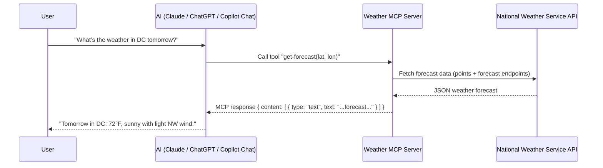

# 🌤️ Weather MCP Server

A Model Context Protocol (MCP) server that provides weather data and alerts using the National Weather Service API.

## 📋 Description

This MCP server provides weather forecast and alert data for US locations through the National Weather Service API. It offers two main tools:
- **Weather Alerts**: Get active weather alerts for any US state
- **Weather Forecast**: Get detailed weather forecasts for specific coordinates

## 🚀 Features

- ⚡ Get weather alerts by state code
- 📍 Get weather forecasts by latitude/longitude
- 🇺🇸 Supports all US locations via NWS API
- 🔄 Real-time weather data
- 📦 Built with TypeScript and MCP SDK
- 🔧 CLI executable for easy installation and usage
- 🖥️ VS Code integration with MCP support

## 🛠️ Installation

1. **Clone the repository**
   ```bash
   git clone <repository-url>
   cd MCP_Node
   ```

2. **Install dependencies**
   ```bash
   npm install
   ```

3. **Set up environment variables**
   ```bash
   cp .envExample .env
   ```
   Edit the `.env` file with your configuration.

4. **Build the project**
   ```bash
   npm run build
   ```

5. **Install globally (optional)**
   ```bash
   npm install -g .
   ```
   After global installation, you can run the server with:
   ```bash
   weather
   ```

## ⚙️ Configuration

The server requires the following environment variables:

- `NWS_API_BASE`: Base URL for the National Weather Service API
- `USER_AGENT`: User agent string for API requests

See `.envExample` for default values.

## 🔧 Usage

### Running the Server

**Option 1: Using npm script**
```bash
npm start
```

**Option 2: Direct node execution**
```bash
node build/index.js
```

**Option 3: Using global installation**
```bash
weather
```

### VS Code Integration

This server is configured to work with VS Code's MCP support. The configuration is available in `.vscode/mcp.json`. To use it in VS Code:

1. Ensure the server is built: `npm run build`
2. The server will be available as `salil-weather-mcp-server` in your VS Code MCP settings
3. Supported models: GPT-4.1 and Claude Sonnet 4

### CLI Usage

After installing globally with `npm install -g .`, you can use the weather command directly:

```bash
# Run the MCP server
weather

# The server will start and listen for MCP protocol messages via stdio
```

The CLI tool provides the same functionality as running the server directly, but with easier access from anywhere on your system.

### Available Tools

#### 🚨 get-alerts
Get weather alerts for a specific state.

**Parameters:**
- `state` (string): Two-letter state code (e.g., "CA", "NY")

**Example:**
```json
{
  "state": "CA"
}
```

#### 🌦️ get-forecast
Get weather forecast for a specific location.

**Parameters:**
- `latitude` (number): Latitude (-90 to 90)
- `longitude` (number): Longitude (-180 to 180)

**Example:**
```json
{
  "latitude": 37.7749,
  "longitude": -122.4194
}
```

## 📁 Project Structure

```
MCP_Node/
├── 📄 package.json          # Project configuration and dependencies
├── 📄 tsconfig.json         # TypeScript configuration
├── � .envExample           # Environment variables template
├── 📄 .gitignore           # Git ignore patterns
├── 📁 .vscode/              # VS Code configuration
│   ├── 📄 mcp.json          # MCP server configuration
│   ├── 📄 settings.json     # VS Code workspace settings
│   └── 📄 launch.json       # Debug configuration
├── �📁 src/                  # Source code
│   ├── 📄 index.ts          # Main entry point
│   ├── 📄 server.ts         # MCP server setup and tool registration
│   ├── 📄 weatherContracts.ts  # TypeScript interfaces
│   └── 📄 weatherRequest.ts    # API request utilities
├── 📁 build/               # Compiled JavaScript files
│   ├── 📄 index.js
│   ├── 📄 server.js
│   ├── 📄 weatherContracts.js
│   └── 📄 weatherRequest.js
└── 📄 .env                 # Environment variables (not in repo)
```

## 🔗 Dependencies

### Production
- `@modelcontextprotocol/sdk`: MCP SDK for server implementation
- `dotenv`: Environment variable management
- `zod`: Runtime type validation

### Development
- `typescript`: TypeScript compiler
- `@types/node`: Node.js type definitions
- `@types/dotenv`: Dotenv type definitions

## 🔧 CLI Installation & Usage

This package can be installed as a global CLI tool for easy access:

### Global Installation
```bash
npm install -g .
```

### CLI Command
After global installation, the `weather` command becomes available system-wide:
```bash
weather
```

This starts the MCP server and makes it available for integration with MCP-compatible tools and applications.

### Package Distribution
The package is configured with:
- **Binary entry point**: `weather` command pointing to `./build/index.js`
- **ESM modules**: Uses modern JavaScript module syntax
- **Files whitelist**: Only distributes the essential `build/` directory

## 🌐 API Reference

This server uses the [National Weather Service API](https://www.weather.gov/documentation/services-web-api) which provides:
- Weather forecasts
- Weather alerts
- Observation data
- Grid point data

**Note:** The NWS API only supports US locations.

## 🐛 Error Handling

The server includes comprehensive error handling for:
- Missing environment variables
- Invalid coordinates
- API request failures
- Unsupported locations (non-US)

## 📝 License

ISC

## 👥 Contributing

1. Fork the repository
2. Create a feature branch
3. Make your changes
4. Run tests and build
5. Submit a pull request

## 🔍 Troubleshooting

### Common Issues

1. **"Missing required environment variable"**
   - Ensure `.env` file exists and contains required variables

2. **"This location may not be supported"**
   - The NWS API only supports US locations
   - Verify coordinates are within US boundaries

4. **"Server not recognized in VS Code"**
   - Ensure the project is built: `npm run build`
   - Check that `.vscode/mcp.json` exists and is properly configured
   - Restart VS Code after making configuration changes

5. **"Permission denied when installing globally"**
   - On Windows: Run PowerShell as Administrator
   - On macOS/Linux: Use `sudo npm install -g .`

## 📊 Development

### Available Scripts

- **Build**: Compile TypeScript to JavaScript
  ```bash
  npm run build
  ```

- **Start**: Run the compiled server
  ```bash
  npm start
  ```

- **Global Install**: Install as a global CLI tool
  ```bash
  npm install -g .
  ```

### VS Code Development

This project includes VS Code configuration for:
- **MCP Integration**: Pre-configured MCP server settings
- **IntelliSense**: Enhanced TypeScript support
- **Debugging**: Launch configurations for debugging
- **Spell Check**: Custom dictionary for technical terms

### File Overview

- **src/index.ts**: Main application entry point, initializes the MCP server
- **src/server.ts**: Registers weather tools and handles tool logic
- **src/weatherContracts.ts**: TypeScript interfaces for API responses
- **src/weatherRequest.ts**: Utility functions for making API requests

